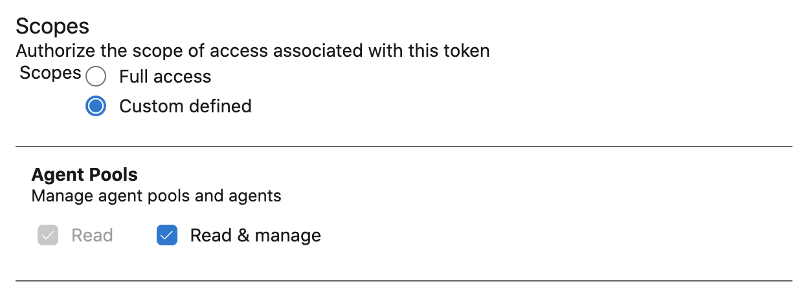

# cleanup-unused-azure-agents

> Cleanup unused agents in Azure self-hosted agent pools.

## Usage

First, make sure you have an Azure Personal Access Token (PAT) with _Read & manage_ permission on the _Agent Pools_ scope. This is the same permission required to use the self-hosted agent, so if you've already generated a token for that purpose you can reuse it here.



You can run the utility by installing it globally:

```console
npm install -g cleanup-unused-azure-agents
cleanup-unused-azure-agents --org Acme --pool 'My Pool' --token XXXX
```

Or, you can run via `npx`:

```console
npx cleanup-unused-azure-agents --org Acme --pool 'My Pool' --token XXXX
```

By default, the utility will poll connected agents once and then pause for 3 minutes before polling a second time. Any agents that were _configured but offline_ in both poll passes will then by deleted from the specified self-hosted agent pool. This behavior is an attempt to prevent race conditions, where a self-hosted agent may be in the middle of connecting from a reboot (in the first phase) or disconnecting due to a reboot (in the second phase). If desired, you can make this delay longer or shorter by passing the optional `--delay` property.

```console
# Use a delay of 5 minutes instead of the usual 3 minutes
npx cleanup-unused-azure-agents --org Acme --pool 'My Pool' --token XXXX --delay 300
```

To run on more than one agent pool at once, specify multiple `--pool` flags or provide a comma-separated list:

```console
npx cleanup-unused-azure-agents --org Acme --pool 'Pool 1,Pool 2' --token XXXX
npx cleanup-unused-azure-agents --org Acme --pool 'Pool 1' --pool 'Pool 2' --token XXXX
```

## Contributions

Pull requests welcome. To ensure tests pass locally:

```console
npm install
npm test
npm run coverage
```

## Disclaimer

This is a community project that provides additional functionality for the Azure DevOps service. It is not published by, affiliated with, or endorsed by Microsoft. All trademarks are properties of their respective owners.
